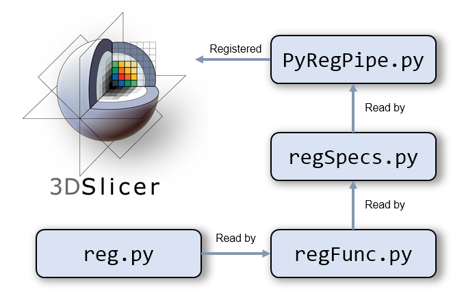

# PyRegPipe

The automatic registration framework using Python for 3D Slicer, developed for the BiRT project.

Developed and maintained by [Yu Sun](mailto:yu.sun@sydney.edu.au). No Python objectas are harmed during the development phase.





## Reference
This framework utilises the Python environment in 3D Slicer for automating the registration steps developed by Reynolds, *et al*. 

> `Reynolds, et. al., Med Phys. 2015 Dec;42(12):7078-89. doi: 10.1118/1.4935343.`

Versions at the time of creation:
* Python v3.6.7
* 3D Slicer v4.11.0

## Modules
There are currently four modules (under the `main` folder):
* `PyRegPipe.py`: the main module which implements the steps to perform *in vivo* to *ex vivo* registration. 
* `ToNIfTI.py`: a module for converting DYNAMIKA DICOM to NIfTI files
* `PrepPk.py`: a module for preparing the folders for DYNAMIKA pharmacokinetic maps.
* `WarpImg.py`: (for heritage files) a module for warping images from the *in vivo* space into the *ex vivo* space, given the exisitng CMTK transformation folder.

`PyRegPipe` is based on Python automation on 3D Slicer functions. The following text describes the background and the utilities which can be used elsewhere.

## Quick start

Currently the framework only automates up to the *in vivo* - *ex vivo* registration. The histology to *ex vivo* registration still depends on MATLAB, so hasn't been included in the process yet. 

### Setup
There are two components regarding the file:

* A set of [tools](https://www.dropbox.com/sh/lkm5xrunkbarqca/AAB9u0uBOsY49qCD5SCJMiAPa?dl=0) including 3D Slicer, CMTK, ImageJ and some bash utilities. These are in the folder `Tools`;
* The code which lives in the folder `code` (this repository).

To set up and use the framework:
* Download the `PyRegPipe.zip` [here](https://www.dropbox.com/sh/lkm5xrunkbarqca/AAB9u0uBOsY49qCD5SCJMiAPa?dl=0) and unzip into a folder (referred as `topFolder`). This includes the 3D Slicer, CMTK, ImageJ and some bash utilities.
* Download this [repository](https://github.com/sunyu0410/PyRegPipe/archive/master.zip) and unzip into the `code` folder. This provides the modules for the registration framework.

This is the correct folder structure:

    - topFolder
        - Tools
        - code
            - cmtk
            - main
            - img
            ...

> This is a portable version. You can put the everything on a USB stick.

## First time launch
You need to register `PyRegPipe.py` as a module. To do that, go to **"Edit" > "Application Settings" > "Modules"**, click "Add" and choose `topFolder/code/main`. You will need to restart Slicer for this to take effect.

After the restart, you will find the `Python Assisted Registration Pipeline` under the `BiRT` category.

### Get started
The module panel consists of the following parts:
1. A notepad area for the user to take notes;
2. Main Panel: to initiate / show the main panel;
3. File List: to show the files generated during the process;
4. Copy Header: a utility to copy the spatial information from a reference image;
5. Flip Image: a utility to flip the image along an axis;
6. Save: click this to save the progress. A Python pickle file called `setting` will be created. Settings will be automatically loaded if Python finds this `setting` file.

Each registration exercise will be considered as a project. Click `Main Panel` and you will prompted to choose a project folder. The project folder needs to contain a subfolder named `data` which holds all the necessary files. If the project folder doesn't comply with the required structure, it will fail to initiate the project.

Once the project folder is chosen, you will be asked to input the patient number (an integer).

> The following instructions will use `prjFodler` to refer to the project folder.

### Working in steps
After the project is initiated, the main panel will be created and shown. There are two main steps:

* `Step 1`: converting DICOM to NIfTI and does the registration between functional MRI and T2w images.

* `Step 2`: *in vivo* to *ex vivo* registration.

When you hover the mouse over the text (left of the Apply button), you will see the detailed list for this task. There is an "Apply" button for each task and a light for status. The light is initiated in orange. It will turn green if no error occur for the tasks, otherwise it will turn red. 

> Here the error simply means a Python error. It doesn't reflect the quality of the registration. E.g. a rigid registration can be run without error but the result can be bad. Hence the user can check the result after each step if wanting to. Use the File List to quickly identify and load the files.

The following section will go through the workflow of `mrhist039` as an example.

#### Step 1
* `step1_1` (T2w Iamges): click **Apply**;
* `step1_2` (DWI): click **Apply**;
* `step1_3` (BOLD, only shown if BOLD data present): click **Apply**. 
    * ImageJ will be called to compute the R2Star maps. When prompted, choose the first image under `prjFolder/temp/R2STAR`. Since ImageJ will memorise the last location, make sure you're under the right `prjFolder`. Once selected, press YES for importing the image series. ImageJ will compute the R2Star map with a number of temporary windows. 
    * Check the orientation of the R2Star map. Use the Flip Image utility when necessary to flip the image.
* `step1_4` (DCE-MRI): click **Apply**;

#### Step 2
* `step2_1` (Conversion): click **Apply**;
* `step2_2` (*ex vivo* 2D 3D): click **Apply**. 
    * You will be prompted to manually align the `ex_2d` and `ex_3d`. Instructions in the Python console.
* `step2_3` (Crop and mask): click **Apply**; 
    * You will be prompted to crop the `ex_3d`. Instructions in the Python console.
* `step2_4` (Manual align and resample): click **Apply**;
    * You will be prompted to manually align the `in_3d` and `(ex_3d)_into_(ex_2d`. Instructions in the Python console. 
* `step2_5` (Run with CMTK): click **Apply**;

> For all manual adjustment (e.g. manual alignment), the automated framework will select the right module (e.g. Transform) and create the right output volume. The user can focus on the task.

The following text describes the background information and the design of the framework. If you're new to Python in 3D Slicer, you might find it helpful.

## Python in 3D Slicer

There are two major aspects for using Python in Slicer: **automation** and **module development**. First, Slicer has an *embedded Python interpreter* which can be used to automate most tasks. This includes loading a file, run a specific module, set the window content, etc. Secondly, Python can be used to develop what's called a *scripted module* in Slicer. These two aspects are often closely inter-related as the scripted module typically applies Python automation to achieve its goals.

> Slicer has three types of modules, command line interface (CLI) modules, loadable modules and scripted modules. The last type can be developed using Python.

### About versions
Slicer prior to version 4.11 embeds a Python 2 interpreter. From version 4.11 onward, it's Python 3. Since Python 3 is the standard (and not backward compatible with Python 2), we should stick to Python 3 as much as we could in general (even outside Slicer). At the time of writing this document (21/02/2020), the latest stable version of Slicer is 4.10.2 and the preview release version is 4.11.0.

The preview release (version 4.11.0) has greatly improved the integration of Python into Slicer. It is tailored for the vast Python user community in the field of medical imaging. Improvement includes the enhanced functionality for package management using `pip` along with the integration of the Python data science ecosystem (e.g. `scipy` and `matplotlib`). As a result, the development in our group is based on the preview release.

### Accessing Python
Click the Python icon to open the Python interactive shell, which will show up at the bottom of Slicer.

## 3D Slicer architectures
It is important to understand the architecture of Slicer so that you can write better scripts in the future. Slicer applies a special notation called **Medical Reality Markup Language (MRML)**. As you will find out, most underlying classes in Slicer have the word "MRML" in their names. When Slicer is open, what you see is the **MRML scene**. This is similar to a stage where players can show up there. Inside the MRML scene, there are different **MRML nodes**. A node is similar to a player on stage. When you load a DICOM into Slicer, a scalar volume node is created. When you convert that into a label map, then it's converted into a label map node. It is possible that you create some node but don't include them in the scene, just as you may recruit some workers but they never show up on the stage. Nodes can also contains other nodes. For example, a scalar volume node may contain the storage node which stores the path of the original data.

> Slicer has wrapped `SimpleITK`, `vtk`, `ctk` and `qt`, which you can all access from the Python interpreter. 

### `ITK` and `VTK`
Slicer largely applies the `ITK` for image processing and `VTK` for visualisation. `SimpleITK` is the Python wrapper of the C++ implemented `ITK`. As mentioned in the sidebar, Slicer Python comes with `SimpleITK` which offers an extensive amount of image processing ability. Similarly, `VTK` is provided via the `vtk` module.

### `Qt` and `ctk`
`Qt` is a versatile cross-platform graphical user interface (GUI) framework developed by Nokia. Slicer has wrapped the whole `Qt` (originally C++) in the module `qt`. Notice that `qt` is a Slicer-specific version of the C++ `Qt`, which is different from the more popular `PyQt` or `PySide`. Since there is no `tkinter` (the default GUI for Python on Windows) in Slicer, if you use `matplotlib` for plotting you need to set the back-end to `qt`.

In addition to `qt`, the Common Toolkit (`ctk`) provides some extra widgets you can use. The most common one is the dropdown list for selecting the input / output data in the CLI modules.

### The **`slicer`** module
When you launch Slicer, you'll find a module called `slicer`. This is the main module you need to access the functionality of Slicer. The `util` sub-module contains the commonly used routines such as loading and saving data. The nodes (mentioned in the previous section) can be found in `slicer`, e.g. `slicer.vtkMRMLScalarVolumeNode` and `slicer.vtkMRMLTransformNode`.

### In a nutshell
The Python interface in Slicer offers a wide range of tools to automate tasks and create customised scripted modules. The current preview release (v4.11.0) ships with Python 3 which is the current standard. With `slicer`, `SimpleITK`, 'vtk`, `qt`, `ctk` and other third-party libraries (e.g. 'Elastix'), this is probably the best environment one can find for medical image processing.

Next we will look at some examples.

## Simple examples
This section includes some commonly used task to get you interested. More comprehensive examples can be found at [Python Scripting](https://www.slicer.org/wiki/Documentation/Nightly/Developers/Python_scripting) and [Script Repository](https://www.slicer.org/wiki/Documentation/Nightly/ScriptRepository).

### Where's that Slicer Python interpreter on disk?
```python
>>> import sys
>>> sys.executable
'I:/Tools/Slicer 4.11.0-2019-11-25/bin/PythonSlicer.exe'
```

### What opening Slicer Python in a terminal?

It will be similar to a typical Python, but some modules related to the MRML are not loaded (e.g. `slicer`). So probably not that useful.
```bash
λ I:/Tools/"Slicer 4.11.0-2019-11-25"/bin/PythonSlicer.exe
Python 3.6.7 (default, Nov 25 2019, 23:26:12) [MSC v.1900 64 bit (AMD64)] on win32
Type "help", "copyright", "credits" or "license" for more information.
>>> import SimpleITK
>>> slicer
Traceback (most recent call last):
  File "<stdin>", line 1, in <module>
NameError: name 'slicer' is not defined
```

### What if packages not there?
Use the `pip_install()` to install packages inside the Slicer Python.
```python
>>> pip_install('pybrain')
Collecting pybrain
  Downloading https://files.pythonhosted.org/packages/be/42/b40b64b7163d360425692db2f15a8c1d8fe4a18f1c5626cf7fcb5f5d5fb6/PyBrain-0.3.tar.gz (262kB)
Building wheels for collected packages: pybrain
  Building wheel for pybrain (setup.py): started
  Building wheel for pybrain (setup.py): finished with status 'done'
  Created wheel for pybrain: filename=PyBrain-0.3-cp36-none-any.whl size=399048 sha256=eb62a5f0adb63f2ca87321849547527d680cc36b532f8af29198e80f2b5bd961
  Stored in directory: C:\Users\ysun1030\AppData\Local\pip\Cache\wheels\21\60\92\907b453266e898b6914f7b175c7f346b4d7c349e2e28ce2b53
Successfully built pybrain
Installing collected WARNING: You are using pip version 19.3.1; however, version 20.0.2 is available.
You should consider upgrading via the 'python -m pip install --upgrade pip' command.

>>> packages: pybrain
Successfully installed pybrain-0.3
```

### How to get the handle of an imaging object?
To get the node (the underlying Slicer Python object), you need to know either the name or the ID of the node. The easiest way is to get the node by its name. This is the name shown under the `Data` module. For example, say we have loaded `in_3d.nii` and by default it will be shown as `in_3d` in Slicer. To get this node:
```python
node = slicer.util.getNode('in_3d')
```
Once you get the node, you can do a variety of operation on the node, similar to how you can process those shown under `Data`, e.g. thresholding the image, register with another image, put under a transformation.

## How to get the Numpy array for an imaging object?
Often you want to process the imaging data in a `numpy` array due to the rich utilities of `numpy`. Once you get the node, you can retrieve the pixel array as a `numpy.ndarray`.
```python
>>> arr = slicer.util.arrayFromVolume(node)
>>> type(arr)
<class 'numpy.ndarray'>
>>> arr
array([[[ 24,  28,  31, ...,   4,   6,   0],
        [ 21,  18,  29, ...,  11,  13,   0],
        [  7,   9,  10, ...,  29,   8,   0],
        ...,
        [222, 233, 233, ..., 160, 155,   0],
        [194, 254, 228, ..., 141, 139,   0],
        [210, 244, 232, ..., 137, 135,   0]]], dtype=uint16)
```

## How to load a file?
```python
# Load a file and capture its returned node
in_3d = slicer.util.loadVolume(r'I:\reg\mrhist039\nifti\in_3d.nii')
```
The resultant node will be returned. In previous version before 4.11.0, you need to pass `returnNode=True` to return the node. In version 4.11.0 onward, the node is by default returned. 

The previous code is equivalent to
```python
# Load the data, but not capture the node
slicer.util.loadVolume(r'I:\reg\mrhist039\nifti\in_3d.nii')
# Get the node, assuming the file is loaded as "in_3d" under the Data module
in_3d = slicer.util.getNode('in_3d')
```

## Saving a file
```python
# Will return a Boolean to indicate save successfully or not
>>> slicer.util.saveNode(in_3d, r'D:/in_3d.nii')
True
```

## Load a scene from a `mrb` file
```python
>>> slicer.util.loadScene(r'I:\reg\mrhist039\temp\11_manual_alignment.mrb')
```
Notice this won't return any value, so you need to explicitly check whether it's successfully loaded.

## Save a scene as a `mrb` file
```python
>>> slicer.util.saveScene(r'I:\reg\mrhist039\temp\test.mrb')
True
```
This will return a Boolean value to indicate the success / failure .

## Utilities

A number of functions have been created for the basic tasks in the file `reg.py`. These functions are used in the registration pipeline. However, one can simply call any of these functions in isolation.

### Add to path
You can use these functions in the typical Python way: import the module and call the functions. The following code is supposed to be executed in the Python console within 3D Slicer.

To import the modules, add the path of `code` to the Python search path.
```python
import sys
sys.path.append(r'I:/code')
``` 

Then you can import `reg.py` since it's now under the search path. Here all functions are imported since it's unlikely to have name clashes with the system variables.
```python
from reg import *
```

You can call any function now. For example, to get the DICOM header attribute from a file:
```python
getDcmAttr(r'I:/path/to/file.dcm', ('0019', '100c'))
```

Please refer to the following section for the important functions.

### Important functions
This section shows the documentations of some of the important functions defined in `reg.py`. The file is located in the `code` folder.
* `getDcmAttr`: get the header attribute in the DICOM file given the key.
* `sortDcm`: sort the DICOM files based on a specific key.
* `cvtSlicer`: convet an imaging file (specified by file extensions).
* `cvtITK`: convert a folder of DICOM files to another format (specified by file extensions using SimpleITK.
* `rigidReg`: rigid registration using BRAINS Registration.
* `invertTfm`: Invert an existing linear .tfm file.
* `warpImg`: resample an image using an exisiting transform.
* `dceMotCorFolder`: find the specific T1 subfolder for DYNAMIKA motion correction.
* `copyHeader`: copy the header information in the refFile to _file.
* `dilateLabelMap`: dilate a label map using Simple ITK.
* `labelMapSmoothing`: label map smoothing using slicer.cli.run().
* `maskVolume`: mask a volume using a label map.
* `getParam`: get the parameters of a Slicer CLI module.
* `morphProcess`: apply a morphological operation on a binary label map.
* `logFilter`: apply the LoG filter on an image.
* `runCmd`: run the command, return the ouptut and error.
* `flipArr`: flip an array (left-right, anterior-posterior and left-right).
* `flipFile`: read the image and save the flipped image.

With these building blocks, we will move to the design of the `PyRegPipe`.

## Design

### Motivation
The main goal is to speed up the iteration loop of the registration framework developed by Hayley. This is achieved by calling the functions developed in the `reg.py`. The framework won't improve the registration performance by itself, but will reduce the time for each step so each iteration loop can be faster.

In addition, the functions from `reg.py` can be used to define any customised workflow, which can greatly speed up the development of the biological atlas.

### Architecture
The framework is a module in 3D Slicer and complies with the requirements from Slicer. There are mainly three files involved, in addition to the underlying `reg.py` under the `code` folder. Technically speaking, all functions can be defined in one Python file. However, this is not the best practice as we want to separate the view from the logic.

* `PyRegPipe.py`: this is the main module file which needs to be registered in Slicer, so that it will be loaded as a module. This file defines the meta-information, the GUI widgets and the logic (functions to be called). It will refer to `regSpecs.py` to construct the main panel.

* `regSpecs.py`: this file contains the display of the main panel and links the buttons with the corresponding functions defined in `regFunc.py`. Hence when the user click a button, it will action accordingly.

* `regFunc.py`: this file defines the action of each step. It uses the functions defined in the utility file `reg.py`. The action for each step will be read by `regSpecs.py` and linked with the buttons accessible to the user.

* `reg.py`: defines the commonly used tasks as functions. These functions can be called individually.

## Details
Let's have a closer look from the bottom up.

First, in `regFunc.py`, the path of the `code` folder is added to the Python search path. All functions in `reg.py`, along a few other separate functions, are imported.
```python
# Add the code folder to the path
topFolder = os.path.abspath(os.path.join(sys.executable, *([os.pardir]*4)))
sys.path.append(os.path.join(topFolder, 'code'))
import genR2StarMacro
from genCmtkScript import genCmtkScript
from dce_motion import corrt_slice
from reg import *
```

After that, there are functions that corresponds to each of the buttons in the automation panel. Each button and the corresponding function share a common name. For example, the first button (labeled as `step1_1`) is to convert the DICOM to NIfTI for *in vivo* 2D & 3D T2w images and rigidly register them. This corresponds to the function `step1_1`.
```python
def step1_1(self):
    '''Step 1: 1. T2w'''
    key = 'step1_1'
    output = self.mergeDict(
        cvtITK(self.in_3d_dcm_folder, self.nii_folder, 'in_3d.nii'),
        cvtITK(self.in_2d_dcm_folder, self.nii_folder, 'in_2d.nii'),
        # Rigid registration, (in_2d)_to_(in_3d)
        rigidReg(fixedImg=path.join(self.nii_folder, 'in_3d.nii'),
                movingImg=path.join(self.nii_folder, 'in_2d.nii'),
                outImg=path.join(self.nii_folder, '(in_2d)_into_(in_3d).nii'),
                outTfm=path.join(self.tfm_folder, '(in_2d)_to_(in_3d).tfm')),
        # Inverse the (in_2d)_to_(in_3d).tfm
        invertTfm(path.join(self.tfm_folder, '(in_2d)_to_(in_3d).tfm'),
                    path.join(self.tfm_folder, '(in_3d)_to_(in_2d).tfm'))
    )
    update(self, key, output)
```

This is similar to all other buttons. In total there are four tasks (if BOLD data is present, otherwise three tasks) in Step 1 and five tasks in Step 2.

Moving onto `regSpecs.py`, `regFunc` is firstly imported so that it has access to all functions in `regFunc.py`.
```python
import regFunc
```
Next, there is a dictionary `specs` which specifies the display of each task and links it with the corresponding function. For example, `step1_1`:
```python
step1_1 = dict(
    step = 'step1',
    key = 'step1_1',
    stepLabel = '''Tasks:
    # 1. Convert in_2d & in_3d to NIfTI;
    # 2. Coregister in_2d to in_3d;
    # 3. Reverse the transformation file;
    ''',
    btnFunc = regFunc.step1_1,
    title = 'T2w Images',
    shortDesc='T2w Images'
)
```

In `PyRegPipe.py`, `regSpecs.py` is firstly imported.
```python
import regSpecs
```

Then there is a function which reads the content from `regSepcs` and create the corresponding GUI widgets.
```python
def createSession(self, step, key, stepLabel, btnFunc, title, shortDesc):
    layout = self.formFramDict[step].layout()
    boxLayout = qt.QHBoxLayout()
    *ignore, fFrame = self.createClp(title, layout, boxLayout)
    self.sessFrames[key] = fFrame
    self.createLabel(shortDesc, fFrame.layout(), stepLabel)
    self.createBtn('Apply', lambda:btnFunc(self), fFrame.layout(), shortDesc)
    self.statusLight[key] = self.createLabel(' ', fFrame.layout())
    self.statusLight[key].setMaximumWidth(20)
    self.setStatus(key, 0)
```

Then the content of the `regSpec` is iterated for creating the widgets.
```python
keys = list(regSpecs.specs.keys())
# If no BOLD, then skip step1_3
if not hasBold:
    keys.pop(keys.index('step1_3'))
for key in keys:
    self.createSession(**regSpecs.specs[key])
```

### Folder structure
A project file need to be specified. The automated framework will manage the files in different sub-folders:

* `Data`: this is the only folder that needs to be set up by the user. It needs to have the following structure. Except for `prostate_contours_from_slicer`, the other folders will contain the DICOM images. Once the user specifies the project folder, the automated framework will check the existence of `data` and its structure.
```
      - data
          - in_vivo_mri
              - in_3d
              - in_2d
              - dwi
              - adc
              - bold (optional)
              - dynamic
              - pk
                  - iauc
                  - ire
                  - ...
          - ex_vivo_mri
              - ex_2d
              - ex_3d
          - prostate_contours_from_slicer
              - xx_in_2d-label.nrrd (xx is the patient number)
              - xx_ex_2d-label.nrrd (xx is the patient number)
```

* `nifti`: this folder contains the NIfTI (`.nii`) files generated. 
* `transformation`: contains the transformation (`.tfm`) files generated.
* `sorted`: stores any sorted DICOM images, e.g. the BOLD data sorted by TE.
* `script`: stores the scripts generated, e.g. the ImageJ script for R2* map calculation.
* `temp`: stores any temporary data, e.g. the `.mhd` files for copying header information.
* `cmtk`: contains the script and initial files to be run by CMTK.


### Other windows
The Python automated framework GUI also contains:
* A file list for viewing the files stored in the `nifti` and `transformation` folder;
* A header copier for copying header information;
* A image flipper for flipping the image in one of left-right, superior-inferior, anterior-posterior. Header information will be maintained.

---
This is the end of the document.

